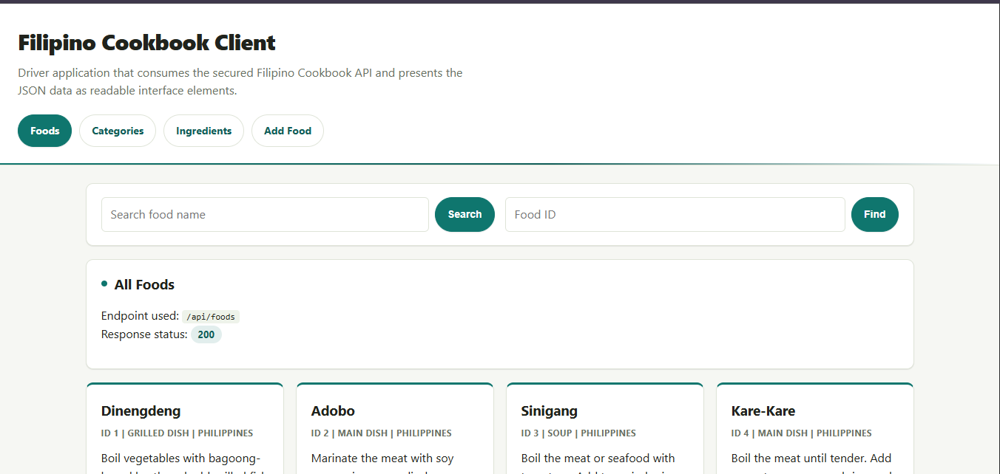
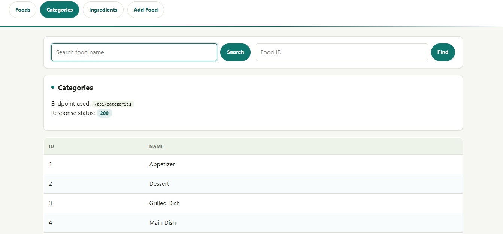
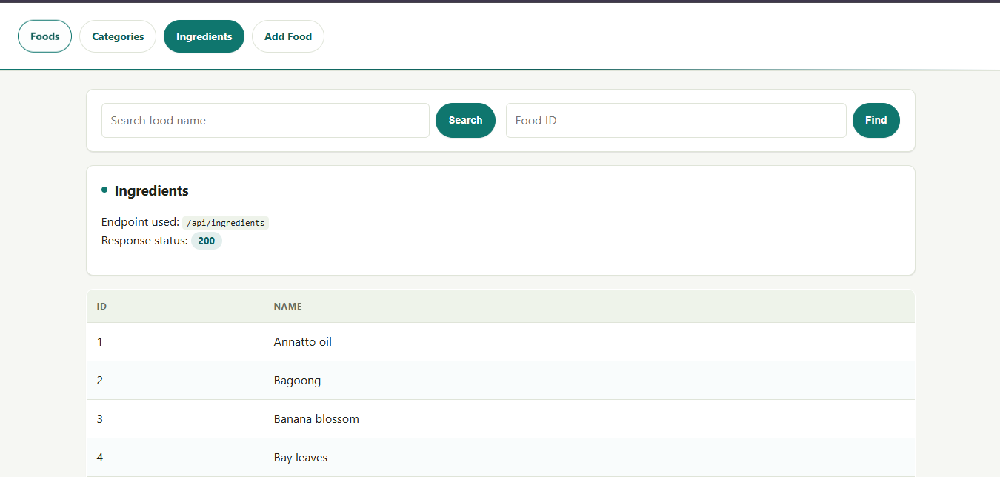
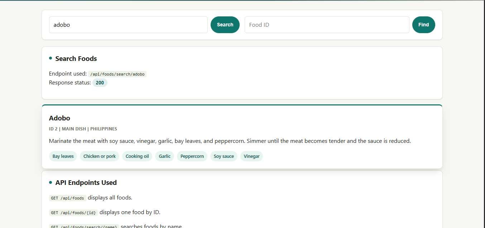
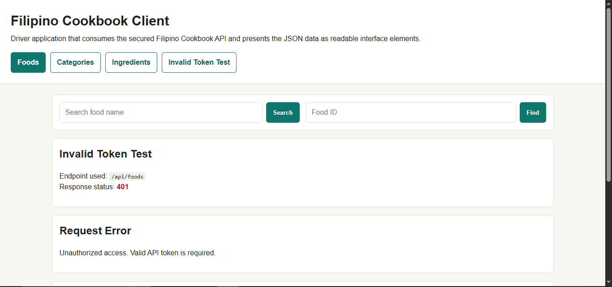

# Filipino Cookbook Client Application

## 1. Application Title

**Filipino Cookbook Client Application**

## 2. Application Description

The Filipino Cookbook Client Application is a separate driver/client program that consumes the secured Filipino Cookbook API developed by a classmate. The application retrieves cookbook data through HTTP API endpoints and displays the responses using readable interface elements instead of raw JSON.

The client allows users to view Filipino food records, search foods by name, find one food by ID, view food categories, view ingredients, and test API authentication using an invalid token request.

This application is intended for students, instructors, and beginner developers who need a simple user interface for testing and presenting API data.

## 3. Technologies Used

| Technology | Purpose |
| --- | --- |
| PHP | Server-side client application and API requests |
| HTML | Page structure |
| CSS | User interface styling |
| Filipino Cookbook API | Data source |
| JSON | API response format |
| XAMPP / Apache | Local web server |
| Git and GitHub | Version control and repository hosting |

## 4. Installation Instructions

1. Clone this client repository into the XAMPP `htdocs` folder.

   ```bash
   git clone https://github.com/YOUR-USERNAME/filipino-cookbook-client-galang.git
   ```

2. Open the project folder.

   ```bash
   cd filipino-cookbook-client-galang
   ```

3. Copy the example configuration file.

   ```bash
   copy config.example.php config.php
   ```

4. Open `config.php` and configure the API settings.

   ```php
   return [
       'api_base_url' => 'http://localhost/filipino-cookbook-api-cuares-main/public',
       'api_token' => 'YOUR_ACCESS_TOKEN',
       'api_developer' => 'Cuares, John Mark Perez',
   ];
   ```

5. Start **Apache** and **MySQL** in XAMPP.

6. Make sure the Filipino Cookbook API is also installed and running.

7. Open the client application in a browser.

   ```text
   http://localhost/filipino-cookbook-client-galang/
   ```

If you keep the client folder inside the API project during local testing, open:

```text
http://localhost/filipino-cookbook-api-cuares-main/client/
```

## 5. API Endpoints Used

| Method | Endpoint | Description |
| --- | --- | --- |
| GET | `/api/foods` | Retrieves all Filipino food records and displays them as food cards. |
| GET | `/api/foods/{id}` | Retrieves one Filipino food record by ID and displays its details. |
| GET | `/api/categories` | Retrieves all food categories and displays them in a table. |
| GET | `/api/foods/search/{name}` | Searches food records by name. |
| GET | `/api/ingredients` | Retrieves all ingredients and displays them in a table. |

## 6. Screenshots

### Foods Display



### Categories Display



### Ingredients Display



### Search Foods Display



### Invalid Token Test



## 7. API Source and Acknowledgment

This client application uses the Filipino Cookbook API developed by:

**Developer:** Cuares, John Mark Perez

**GitHub Repository:** https://github.com/cuaresjohnmark-ux/filipino-cookbook-api-cuares

The API is used for educational purposes with the permission of the developer.
